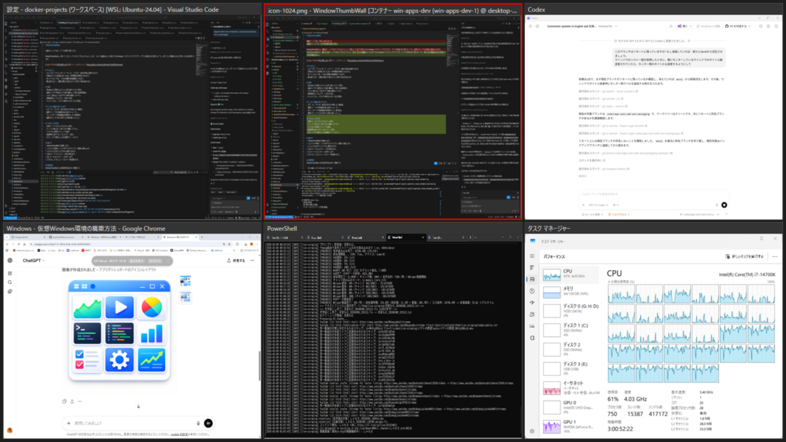

# WindowThumbWall

必要なウィンドウを、いつでも視界に置いておく。

WindowThumbWall は、開いているウィンドウをライブサムネイルとして並べ、ひとつの壁面のように表示できる Windows デスクトップアプリです。アプリを何度も切り替えなくても、見ていたい情報をまとめて表示したまま作業できます。

[English README](README.md) | [最新リリースのダウンロード](https://github.com/tsuchim/WindowThumbWall/releases)

## できること
- ビルドログ、ダッシュボード、チャット、ブラウザ、端末を同時に監視できます。
- 作業中のアプリを前面に保ったまま、参考情報を常時見ておけます。
- 余っているモニタを、そのまま軽量な監視壁面にできます。
- 静止画ではなく、実際に更新され続けるライブ表示で状況を追えます。

## 特長
- Windows の DWM サムネイル API を使ったライブ表示。
- 画面キャプチャ配信のような重い構成なしで使える低負荷設計。
- スロット数に応じて並びやすい柔軟な壁面レイアウト。
- 最前面表示とフルスクリーン表示に対応。
- タスクバーで点滅したウィンドウを、サムネイルの赤い点滅枠で気づけます。
- サムネイルをクリックすると、その元ウィンドウをすぐアクティブにできます。
- テレメトリなし、クラウド依存なしのローカル完結型。

## こういう用途に向いています
- ログ、CI、ブラウザ、端末を見ながら作業したい開発者。
- 複数チャートや分析画面を追い続けたいユーザー。
- ダッシュボードや監視画面を常時表示したい運用担当。
- 複数のウィンドウを行き来する手間を減らしたい人。

## できることの中身
- 外部ウィンドウのライブサムネイル表示。
- ウィンドウ数に応じて使いやすい壁面レイアウト。
- リストからの素早いウィンドウ追加。
- サムネイルから元ウィンドウへのワンクリック復帰。
- 点滅中ウィンドウを見逃しにくい赤枠通知。
- 監視専用に使いやすいフルスクリーン表示。
- 元ウィンドウが閉じたときの自動クリーンアップ。

## 使い方
1. WindowThumbWall を起動します。
2. リストから対象ウィンドウをダブルクリックして壁面へ追加します。
3. サムネイルをクリックすると元のウィンドウを前面に戻せます。
4. サムネイルを右クリックすると削除できます。
5. 監視中のアプリがタスクバーで点滅すると、壁面上でも赤枠で通知されます。
6. Enter キーでフルスクリーンを切り替えます。
7. Esc キーでフルスクリーンを終了します。
8. 左下のヒントからショートカット一覧を開けます。

## 配布形式
WindowThumbWall の公式配布形式は次の 3 種類です。

- ZIP: 展開してすぐ使えるポータブル版。
- MSI: 標準的な Windows インストーラ版。
- MSIX: クリーンアンインストールに向くモダンなパッケージ版。

## プライバシー
- テレメトリはありません。
- クラウド送信はありません。
- 外部サーバーへのデータ送信はありません。
- レイアウト復元に必要な状態だけをローカルに保存します。

詳細: [PRIVACY.md](PRIVACY.md)

## 利用上の注意
WindowThumbWall は現状有姿で提供されます。すべての Windows 環境や利用形態での互換性、継続的な動作、特定目的への適合性を保証するものではありません。重要な用途に利用する前に、ご自身の環境とウィンドウ構成で十分にご確認ください。

## ストア登録用コピー
以下は、そのままストア登録画面へ貼り付けやすい文章です。

### 製品名
Window Thumb Wall

### 概要
複数のウィンドウを同時に見渡せる、低負荷なライブサムネイル壁面アプリです。

### 詳細説明
Window Thumb Wall は、複数のウィンドウをライブサムネイルとして並べて表示できる Windows アプリです。

アプリを何度も切り替えなくても、必要なウィンドウを一度に見続けられます。ビルドログ、ダッシュボード、チャット、ブラウザ、端末、チャート、監視画面など、仕事や確認に必要な情報をひとつの壁面にまとめられます。

表示には Windows 標準の Desktop Window Manager サムネイル API を使っているため、画面キャプチャや配信ソフトのような重い構成なしで、軽快にライブ表示を維持できます。

主な価値:
- 複数ウィンドウを同時に確認できる。
- Alt+Tab を繰り返す回数を減らせる。
- 余っている画面領域を監視壁面として活用できる。
- 静止画ではなくライブの更新状態をそのまま見られる。
- 点滅中のウィンドウを赤枠で見つけやすい。
- サムネイルから元ウィンドウへすぐ戻れる。

主な機能:
- 外部ウィンドウのライブサムネイル表示。
- 柔軟な壁面レイアウト。
- ウィンドウ選択リストからの追加。
- サムネイルクリックで元ウィンドウをアクティブ化。
- タスクバー点滅に連動した赤枠通知。
- フルスクリーン表示。
- 最前面表示。
- ローカル完結、テレメトリなし。

Window Thumb Wall は、複数の情報を見ながら作業したい人のための、実用的で軽量なデスクトップツールです。

注意:
本アプリは現状有姿で提供されます。Windows のバージョン、モニタ構成、監視対象アプリによって動作や相性が異なる場合があります。重要な用途に利用する前に、ご自身の環境で事前にご確認ください。

### 更新内容テンプレート
各リリースの更新内容は、生成されるストア用メタデータからそのまま貼り付けられます。

### プロモーション テキスト
空いている画面を、そのままライブ監視壁面に変えられます。

### 検索キーワード
ウィンドウ監視, サムネイル, 壁面表示, ダッシュボード, マルチタスク, 生プレビュー, Windows ツール

## 開発者向け情報
ビルド手順、パッケージング、リリース運用などの開発者向け情報は README から分離しました。

- [開発者ガイド](docs/developer-guide.md)
- [リリース手順](docs/releasing.md)
- [不変条件](docs/invariants.md)

## ライセンス
GNU General Public License v3.0. 詳細は [LICENSE](LICENSE) を参照してください。
